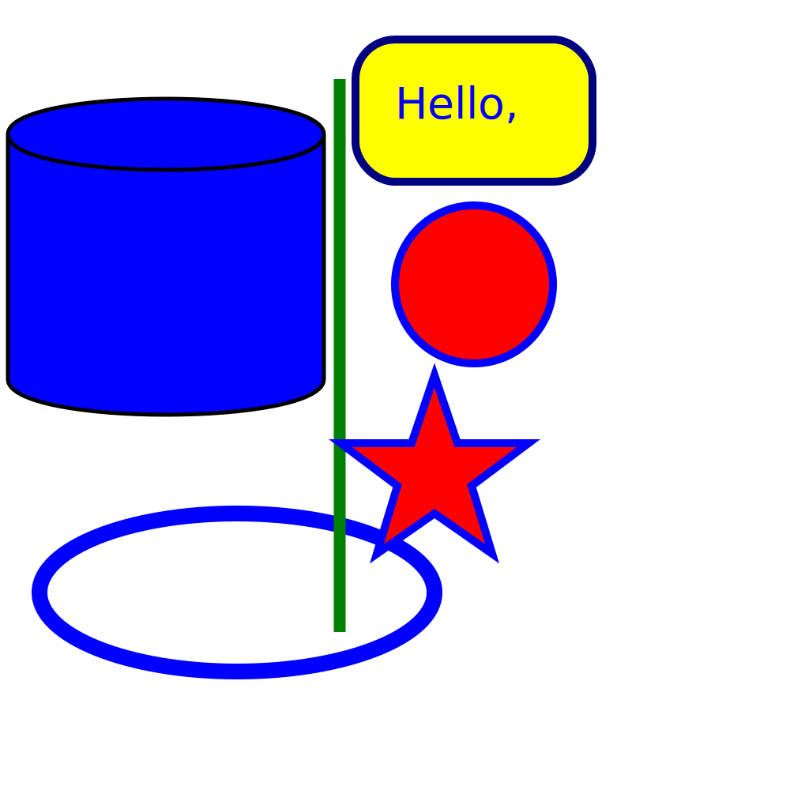
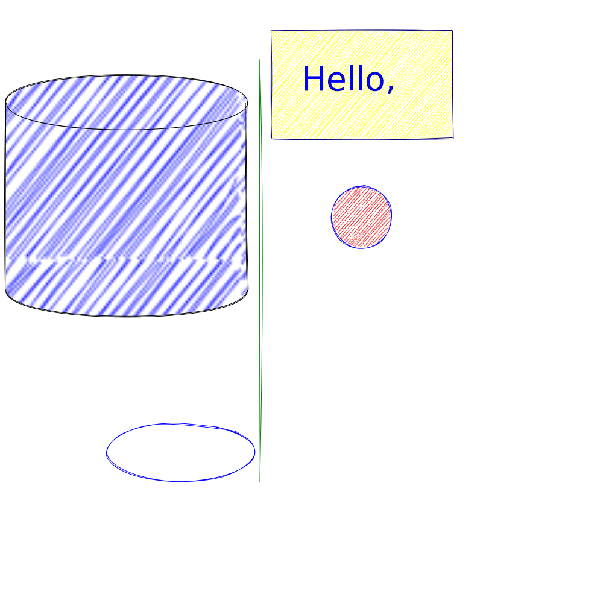

# rougher.js

CLI tool that applies [rough.js](https://roughjs.com/) ( [GitHub](https://github.com/pshihn/rough) ) to existing SVG file and new rough SVG.

## Example

Base image:


-> Translated image:



## Build and Execution

```sh
$ git clone $THIS_REPOSITORY
$ cd $REPOSITORY_DIRECTORY
$ yarn install
$ yarn build ; yarn link ; rougher ./examples/source.svg > examples/translated.svg
```

## Dependencies

- Node.js
- Yarn
